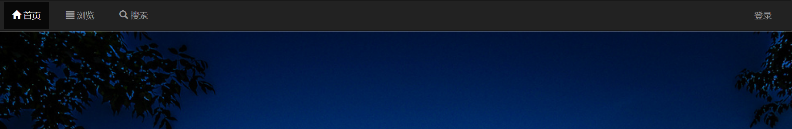
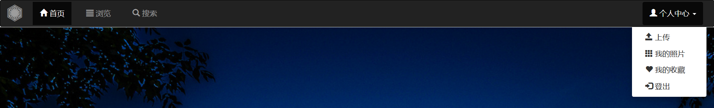
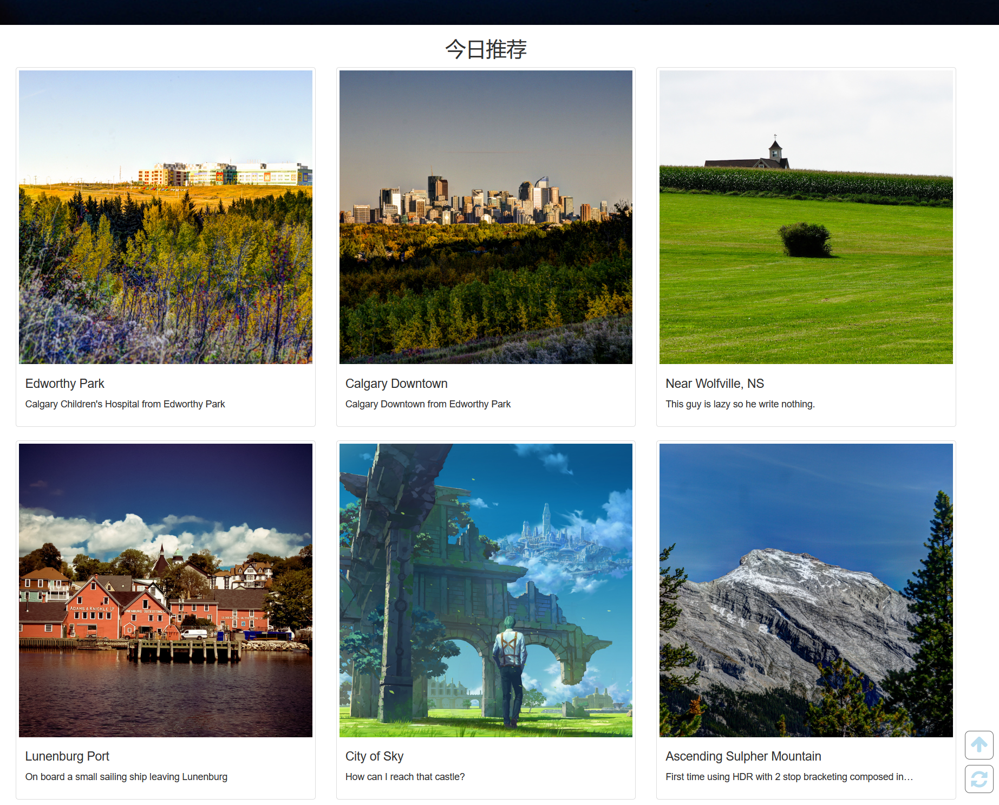
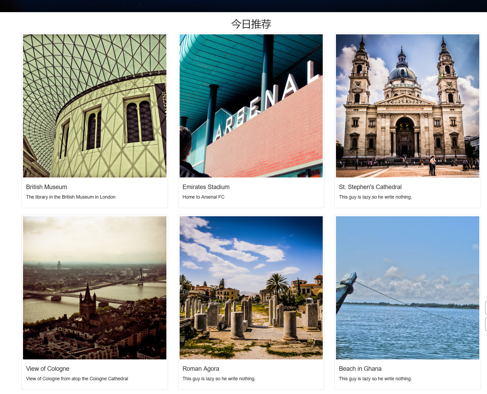

# 实验报告

姓名：赵书誉

学号：18307110072

github提交地址：https://github.com/Dying-fish/19ss_Project2

网页部署地址：http://39.101.164.194/index.html

## 项目完成情况

### 首页

#### 导航栏

用户未登陆时，**个人中心**显示为**登录**，点击后直接跳转至登录界面，不会出现下拉菜单

用户登录后

#### 今日推荐

**热门图片:**从后端数据库中读取的收藏最多的图片，点击图片后进入详情页

#### 刷新

 随机从数据库中读取一组图片，点击图片后进入详情页

### 浏览页

#### 筛选

**筛选选项：**主题是直接写在html中，国家则是从后端数据库中查找存在照片的国家，然后用js添加到选项中。

**二级联动：**点击国家选项后，根据所选的国家搜索存在照片的城市，用js添加到选项中。

#### 热门内容

从数据库中选取上传图片最多的主题、国家、城市

#### 翻页按钮

翻页后会显示当前位置，切换图片

#### 标题查询

支持中文输入，模糊查询，未查询到图片时有提示

### 搜索页

#### 标题查询

#### 简介查询

### 照片详情页

通过URL传递图片ID，然后从数据库获取并显示照片信息，登录状态下会判断用户是否已收藏该照片。

用户未登录时点击收藏会弹出“请先登录”的文字。登录状态下点击按钮，按钮中文字会变为“已收藏”。

### 登录界面

**登录失败**

**登录成功**

### 注册界面

**填写错误**

若密码格式正确但两次密码不一致时，x会变为提示文字“密码不一致”。

**填写正确**

**邮箱重复：**允许相同用户名但不允许相同的邮箱，一秒后跳转至注册界面

**注册成功**：跳转至登陆界面

### 我的收藏

直接根据用户UID从数据库中找到收藏的照片进行展示

#### 按钮

按下后弹出提示，页面刷新，然后数据库中删去收藏的记录

### 我的照片

同上，按下删除按钮后删除照片，页面刷新，按下修改按钮后进入修改界面。

#### 修改界面

不修改照片本身，但可以修改标题、简介，主题国家城市的选项默认选中原先信息。

**修改成功**时跳转至**我的照片**。

### 上传界面

填写完信息后会将表单提交到Upload.php，**上传成功**时会显示上传成功，然后跳转至**我的照片**,若上传失败，则会跳转回上传界面。若存在图片路径重复的情况则会提示文件已存在。

## Bonus

### 现代的前端框架

没有用Vue，React，Angular一类mvvm框架，用BootStrap重写了一遍页面。

**感想：**使用起来很便捷，大概只用了一天半的时间就重写完了，使用网格布局解决了一些地方排版的问题，但用到的功能还是比较少的，不然例如浏览页可以使左侧边栏可折叠，删除照片，取消收藏时弹出确认框。

但是默认布局无法修改比较难受，如果想要微调样式，例如修改导航栏颜色时，必须下载BootStrap的资源然后在内部代码中修改才行。

一开始想试着用Vue写前端，但尝试了一下后觉得在尚不熟悉php和js的情况下重写工作量有点大，不一定能保证完成，遂放弃。但感觉Vue熟悉后可以很有效地提高效率？

### 部署到服务器

小手一抖，直接领了6个月的服务器orz

一开始时花了4小时试图解决死活连不上mysql的问题，后来一气之下初始化重来了一遍，好了。

网页部署地址：http://39.101.164.194/index.html

## 意见与建议

20分的Bonus有点尴尬，感觉要么更狠一点40分，要么就10分意思一下。

个人意见：如果pj2和pj1同时发布可能会更好。对于有基础的同学可以根据pj2的要求事先在pj1做好调整或提前开工pj2，没有基础的同学也能按部就班地来。

老师课讲得很好，助教也很和善，没有任何意见。